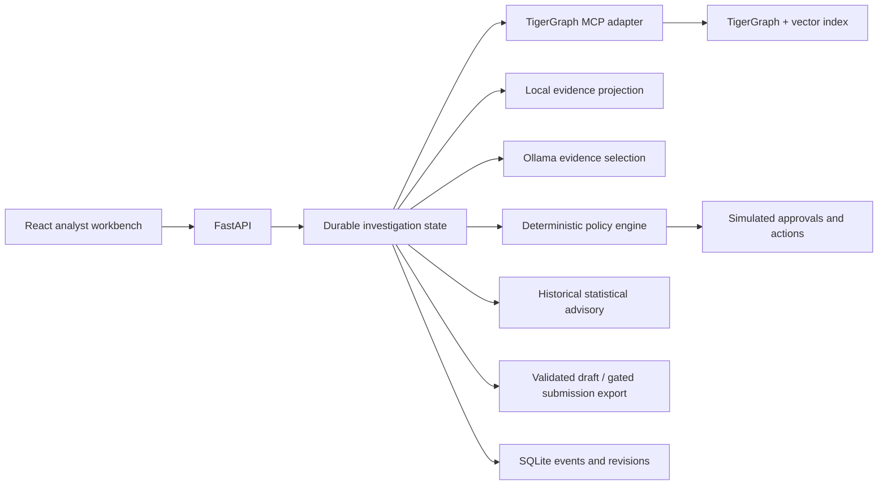

# Architecture

## Data flow

The streaming importer reads the organizer CSVs without replacing IDs or recovering public outcomes. It resolves card signatures from explicit case anchors. Local SQLite stores a queryable projection and durable application state, while original CSVs preserve all source fields. Graph provisioning uploads the same projection, historical cases, relationships, policy text, and locally generated embeddings to TigerGraph.

The GSQL layer implements customer history traversal, time-bounded device expansion, historical case lookup, and bounded breadth-first network expansion. Before labeling evidence as graph-backed, the adapter verifies returned transaction values and historical case content against the source projection. Vector context must be retrieved from the real index. If anything fails, local mode remains explicit.

An investigation builds supporting and opposing findings, scopes candidate episode transactions, calculates exposure, and applies the policy. The local LLM chooses relevant evidence and a bounded follow-up tool. Its displayed factual summary is assembled from verbatim evidence, preventing unsupported narrative assertions from becoming facts.

## State and approvals

Events append; current case state updates with a revision. The original action list is preserved across recorded response changes. Scenario exploration returns hypothetical actions without saving them. Demo approvals must reference an action and approval route from the current decision revision. An approval never triggers a real financial or regulatory operation.

## Models

`qwen3:4b` runs locally with bounded output/context and serialized requests. `all-minilm` generates 384-dimensional embeddings locally. Both are free, cached, and separate from the statistical advisory.

The optional historical model uses anonymous numerical Vesta features plus supplied transaction signals. It trains on investigations opened and closed before September, calibrates on September investigations closed before October, and reports October diagnostics. Its selected-cohort probabilities are not assumed to transfer to the benchmark. It does not override graph/policy decisions.

## Trust boundaries

- Organizer documents and model output are data, not instructions to send messages or enable services.
- TigerGraph MCP tools are schema-validated; errors and partial uploads fail visibly.
- `.env`, downloaded data, model artifacts, and local database files are excluded from Git.
- The service binds to loopback. This is a local demonstration, not production authentication or regulatory compliance software.
- Pickled statistical artifacts are loaded only from this project's local training output; never load third-party pickle files.

## Known limitations

Remote TigerGraph schema/query compilation has not been verified without a workspace. Network expansion and local baselines have explicit bounds; candidate discovery is not automatic proof of a fraud ring. Customer, merchant, and settlement facts absent from the dataset are not invented. Probability calibration and hidden benchmark accuracy remain separate from UI completeness and JSON validation.
