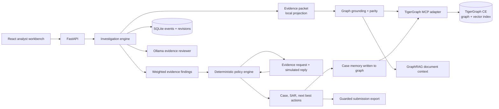

# Architecture

## The shape of an investigation

`engine.investigate` runs one trigger end to end and appends an event at every step, so the
UI and the exported answer describe the same run.

1. **Collect.** `analysis.collect` builds a bounded packet from the local projection: the
   customer's baseline before the episode, the card's 48-hour window, the card's own
   preceding 30 days (so velocity is measured against this card's rhythm rather than a
   constant), device-profile neighbours, concurrent activity in familiar billing regions,
   the region run, and closed cases admissible before the alert.
2. **Ground.** `retrieval.ground` re-derives the same evidence through GSQL over
   TigerGraph MCP. It compares the graph's aggregate over the window against the local
   projection's, then checks a bounded sample transaction by transaction, fetches the
   flagged transaction explicitly, confirms every retrieved closed case exists and closed
   before the cutoff, and requires admissible vector context. Any disagreement raises and
   the case stays local-only and is refused by the exporter.
3. **Assess.** `analysis.assess` emits named findings with fitted log-odds weights, sums
   them, and derives verdict, pattern and episode scope.
4. **Decide.** `policy.decide` is a direct transcription of the supplied policy. It is the
   only thing that chooses actions; the model never does.
5. **Request evidence.** When the policy needs more (R1, or conflicting evidence under
   R7/R8), the engine records the request, simulates the reply with its basis, folds it
   back through `apply_response`, and recomputes. `initial` and `final` both survive.
6. **Explain and persist.** The summary, SAR narrative and `stop_reason` are generated
   from the findings actually used. `tigergraph.persist` writes the case with queryable
   attributes, verifies the read-back byte for byte, and links it to its transactions,
   card, connected cards, device profile and cited prior cases.

## Why the risk score is excluded

Within the closed-case record the bank's score is inverted at ROC-AUC 0.053: every cleared
case scored 0.82 or higher. That reflects which alerts were opened and closed, not which
activity was fraud, and the benchmark samples risk-score triggers from 0.52 to 0.90. Using
it would fit the sampling frame. `WEIGHTS` contains no entry for it and
`test_score_alone_cannot_move_the_assessment` asserts that two cases differing only in
score assess identically.

## Why the queries are interpreted

`INSTALL QUERY` compiles GSQL to native code. On a Community Edition container that
compile is the single step that reliably exhausts memory and takes GSQL down. Interpreted
execution runs the same GSQL, from the same reviewed bodies, against the same graph.
`tigergraph.QUERY_BODIES` holds the bodies; `tigergraph/queries.gsql` holds the installable
form, and `provision_tigergraph.py --schema` installs them one at a time where the host has
headroom.

Interpreted queries take no parameter list, so values are substituted into the text.
`tigergraph.literal` refuses anything that is not an identifier or timestamp before it
reaches the server.

## Why parity is checked by aggregate

TigerGraph returns a 514-row projection in about four seconds and 143 KB. The MCP server
then wraps each result in a markdown envelope and repeats it in its own summary, so a few
hundred rows become a multi-megabyte streamed response that times out and takes the service
with it. The queries therefore return an aggregate over the whole window plus a capped
sample. The aggregate is the stronger check — it covers rows the sample never sees — and the
flagged transaction is fetched explicitly so no claim rests on an unverified row.

## State and approvals

Events append; case state updates with a revision. The initial recommendation is preserved
across every later change. Scenario exploration returns hypothetical branches without
saving them. A demo approval must name an action and route from the current revision. An
approval never triggers a real financial or regulatory operation.

## Models

`qwen3:4b` runs locally with bounded context and output and serialized requests. It selects
which evidence best characterises the assessment and may choose one read-only follow-up
tool from a fixed list. Displayed factual text is assembled from verbatim evidence, so a
generated sentence can never enter the record as a fact. `all-minilm` produces the
384-dimension embeddings. Both are local and cached; a model failure is visible and does not
fabricate a successful review.

The gradient-boosted model in `scripts/train_assessment.py` is a separate diagnostic. It
scores ROC-AUC 0.966 on October closed cases but saturates at 0.99 on 19 of the 20 benchmark
cases, which is a distribution mismatch rather than confidence. It stays advisory and never
drives a verdict.

## Trust boundaries

- Organizer documents, retrieved narratives and model output are data, never instructions.
- MCP tool arguments are validated against the server's own schema before they are sent.
- GSQL literals are allowlisted before substitution.
- `.env`, downloaded data, model artifacts and the local database stay out of Git.
- Services bind to loopback. This is a local demonstration, not production authentication
  or compliance software.
- Pickled artifacts are loaded only from this project's own training output.

## Known limitations

The assessment is fitted on investigated alerts, not the general transaction population.
Holdout accuracy is not benchmark accuracy. Network expansion is bounded, and a shared
device profile is a lead rather than proof of common ownership. Customer, merchant and
settlement facts absent from the dataset are not invented. Community Edition on a small
container needs the memory right-sizing in the README, and `run_benchmark.py --require-graph`
exists because one pass is not a reliable result on that hardware.
